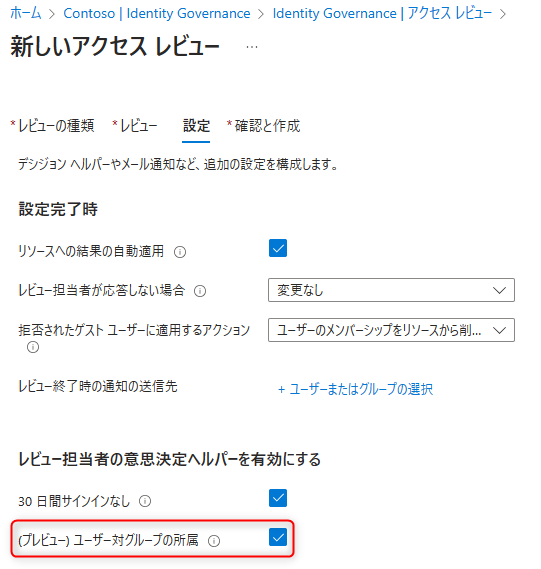
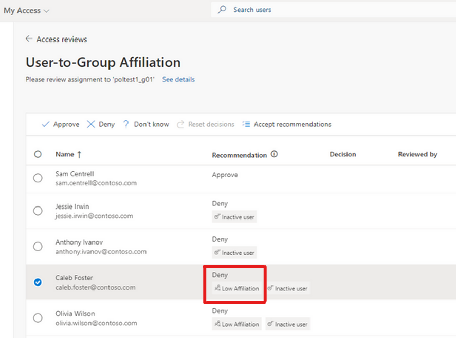
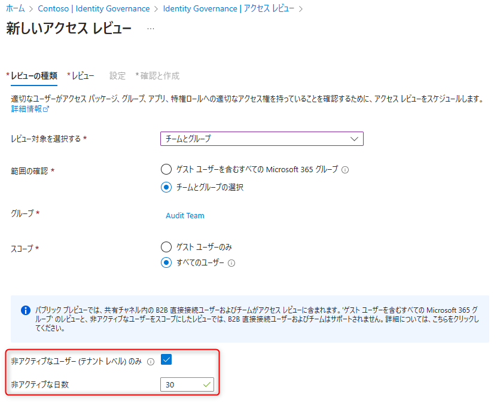

こんにちは、Azure Identity サポート チームの 北村 です。

本記事は、2023 年 7 月 17 日に米国の Microsoft Entra (Azure AD) Blog で公開された [Microsoft Entra ID Governance Introduces Two New Features in Access Reviews](https://techcommunity.microsoft.com/t5/microsoft-entra-azure-ad-blog/microsoft-entra-id-governance-introduces-two-new-features-in/ba-p/2466930) を意訳したものになります。ご不明点等ございましたらサポート チームまでお問い合わせください。

---
# Microsoft Entra ID Governance が アクセス レビューに2つの新機能を導入

2023 年 6 月 7 日に発表されたとおり、[Microsoft Entra ID Governance](https://techcommunity.microsoft.com/t5/microsoft-entra-azure-ad-blog/microsoft-entra-id-governance-introduces-two-new-features-in/ba-p/2466930) が**一般提供**され、これにより企業が合理化されたアクセス管理を追求できるようにする一連の新機能が提供されます。これには、Machine Learning (ML) を利用したアクセス レビューの推奨事項と、ユーザーの非アクティブなアクセス レビューのスコープ設定が含まれます。これらの新機能は、アクセス レビュー機能を強化する先進のテクノロジーを活用したもので、レビュー担当者に推奨事項を提供し、非アクティブなアカウントを定期的にレビューして削除することで、セキュリティ管理をシンプルにするものです。

これらの機能により、いかにして組織が意思決定を行い、重要なリソースを保護できるのか順に見てみましょう。

## 機械学習をベースとしたレビュー担当者向けの推奨事項

アクセス レビューは、組織内で適切なユーザーが適切なアクセス許可を持つようにする上で、重要な役割を果たします。しかし、レビュー担当者にとってこのレビューにおける意思決定プロセスは困難で時間がかかるものです。そこで、機械学習をベースとしたレビュー担当者向けの推奨事項が有用となります。この機能は、機械学習アルゴリズムと組織の階層構造を組み合わせることで、レビュー担当者に示唆に富んだ推奨事項を提供し、レビュー担当者が十分な情報に基づいた意思決定を迅速に行えるようにします。とはいえ、この推奨事項は重要ではありますが、人工知能 (AI) と機械学習のにはまだ未熟な部分もあることを強調する必要があります。

### シナリオ: レビュー担当者がより迅速かつ正確に判断を下せるようレビュー プロセスを簡素化したい

アクセス権の確認を一斉に依頼する際に、レビュー担当者に効率的に作業してもらいたいと思うのが常です。アクセス レビューを作成する際、レビュー担当者の意思決定を支援する一環として [ユーザー対グループの所属] を利用いただけます。

 

「ユーザー対グループの所属」の推奨事項は、組織の階層構造も考慮しながら、グループ内の他のユーザーとの相対的な所属関係を分析します。機械学習ベースのスコアリング メカニズムを利用することで、グループ内の他のユーザーとの距離が著しく離れているユーザーを特定し、そのユーザーは "所属度が低い "ことが示されます。 

レビュー担当者は、アクセス レビューの際、マイ アクセスにこの推奨事項が表示されるようになります。これらの情報は、アクセスの承認または拒否を決定する前に、より詳細な精査が必要な候補者にフラグを立てるのに役立つと共に、レビュー担当者のレビュー効率の向上、確認に伴う疲労の軽減、機密リソースの安全性を確保できるよう支援します。

これらの情報を元に、レビュー担当者はアクションを起こすことができます。[推奨事項の承認] をクリックして推奨事項を受け入れるオプションがあり、迅速かつ効率的な意思決定が可能になります。あるいは、レビュー担当者が手動で推奨事項を確認し、それに応じてアクセスを承認するか拒否するかを判断することもできます。この機能により、レビュー担当者は十分な情報に基づいた意思決定を行うことができ、同時にアクセス レビューに必要な時間と労力を削減することができます。

詳しくは、こちらをご覧ください: [アクセス レビューのためのレビューの推奨事項](https://learn.microsoft.com/ja-jp/azure/active-directory/governance/review-recommendations-access-reviews)

## 非アクティブなユーザーのスコープ設定 

利用されていないアカウントは潜在的なセキュリティ リスクを引き起こす可能性があるため、非アクティブなユーザー アカウントの管理は組織にとって重要な課題です。ID ガバナンス機能では、非アクティブなユーザーのスコープ設定の導入により、この課題に対処します。この機能を使用すると、管理者は、指定された期間アクティブになっていない古くなったアカウントをレビューし、対処することができます。対話型サインイン アクティビティと非対話型サインイン アクティビティの両方を網羅することで、非アクティブなユーザーのスコープ設定により、ユーザーの活動状態を包括的に確認できるようになります。管理者は、30 日、60 日、90 日などの特定の期間を設定して、非アクティブなアカウントを特定できます。レビュー プロセスの一環として、古くなったアカウントを自動的に削除することもできます。

### シナリオ: 重要なグループ内の非アクティブなユーザーを定期的にレビューするよう設定したい

過去 30 日間に Azure AD のどのアプリケーションにも (対話型、非対話型の両方で) サインインしていない監査チームのグループに対して、定期レビューを設定したいと考えています。そのためには、新しいアクセス レビューを作成し、グループを選んで、グループ内のすべてのユーザーを選択し、しきい値を 30 日として、非アクティブなユーザーに対する新しいオプションを選択します。

非アクティブなユーザー アカウントを削除することで、攻撃の対象範囲が縮小し、不正アクセスのリスクが最小化されるため、組織のセキュリティ体制が向上します。古くなったアカウントを定期的に見直して削除することで、組織はアクセス権限がビジネス要件に適合していることを確認し、無駄のない安全なユーザー環境を維持することができます。

## ぜひお試しください

これらの新機能をぜひお試しください！現在 Microsoft Entra ID Premium をご利用のお客様は、2 つの方法で新機能をご利用いただけます： 

1. [https://aka.ms/EntraIDGovTrial](https://aka.ms/EntraIDGovTrial) で Microsoft Entra ID Governance の試用版をセットアップする。
2. Microsoft Entra ID Governance にアップグレードする。ライセンスをオンラインで購入するか、ライセンス パートナー経由で購入するか、Microsoft アカウント チームと連携している場合は Microsoft から直接購入可能です。

Joseph Dadzie 
Partner Director of Product Management 
LinkedIn: @joedadzie 
Twitter: @joe_dadzie 
